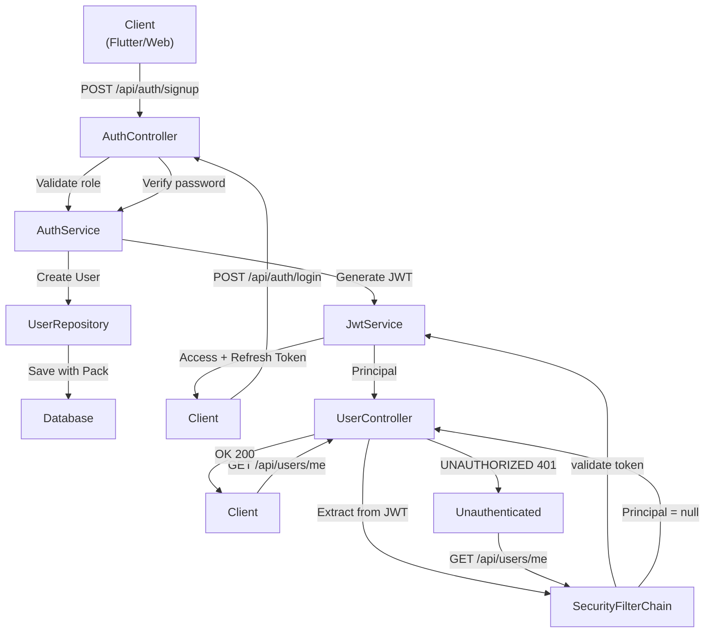
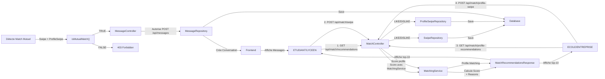
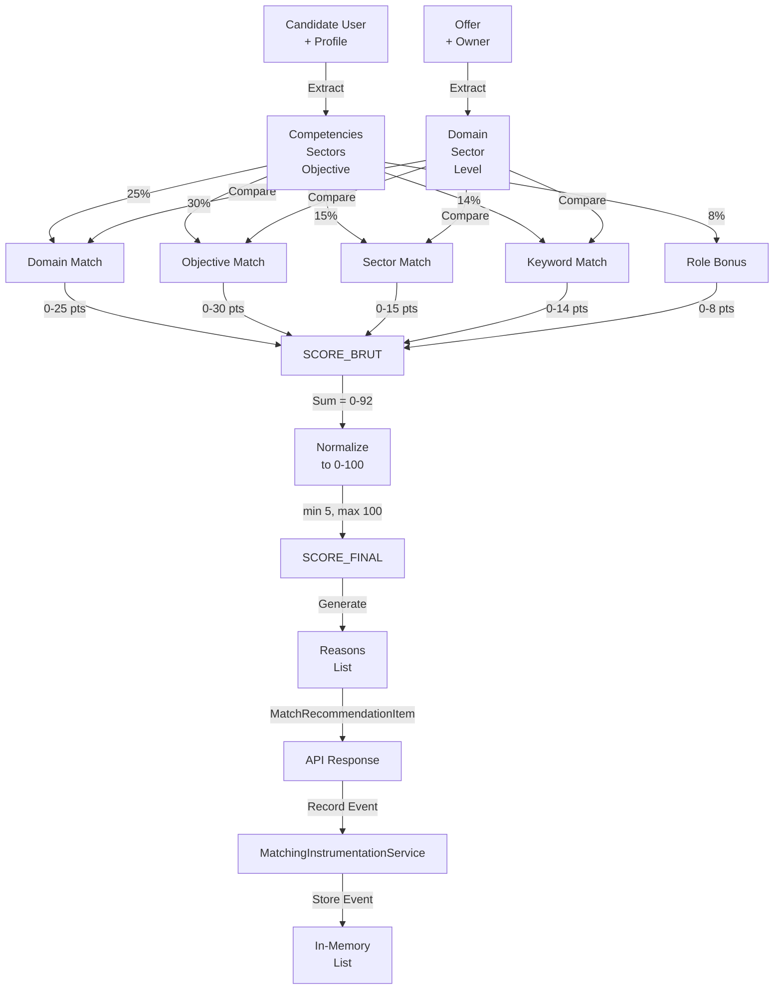
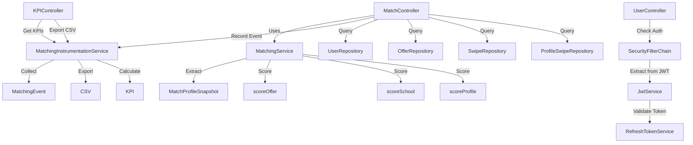
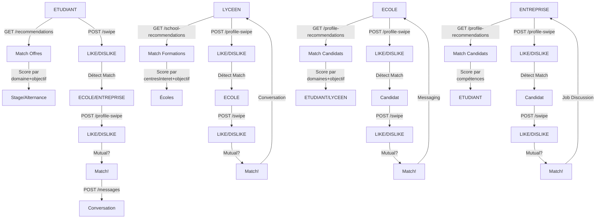
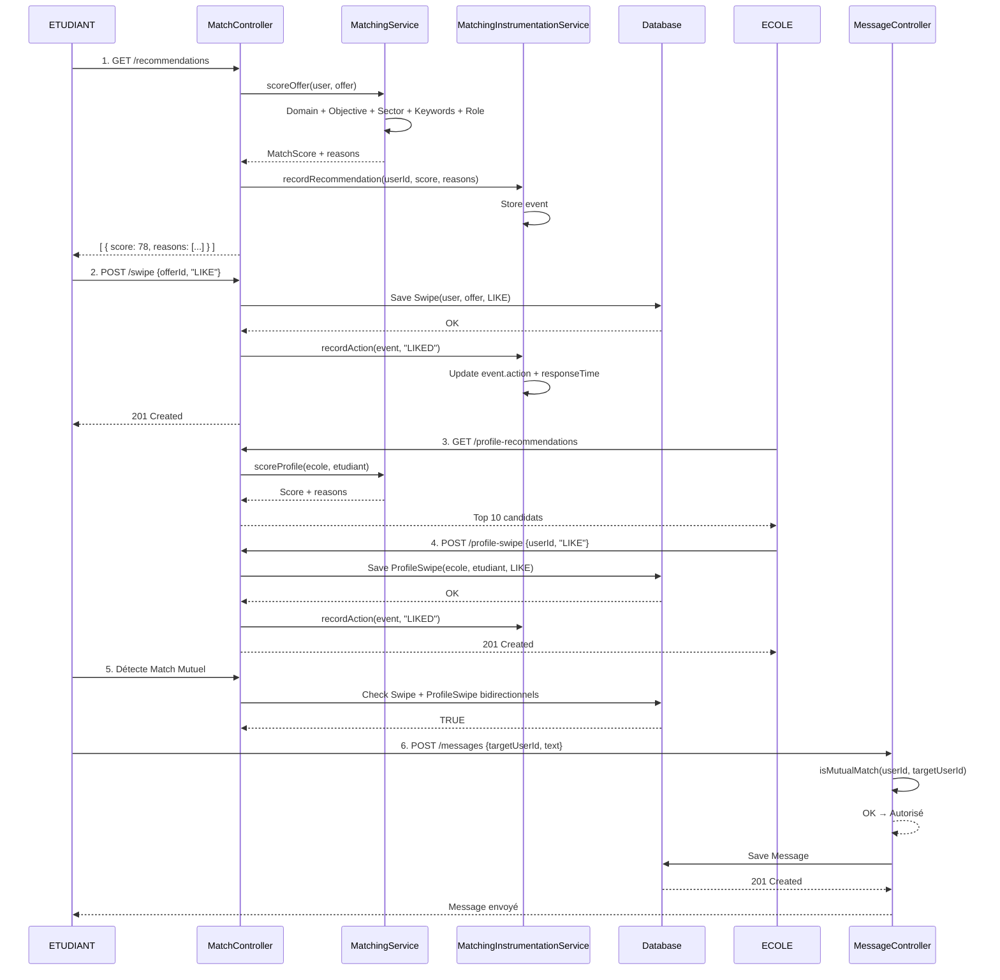
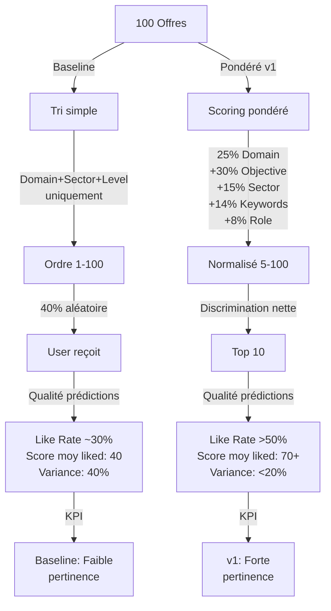

# Architecture et Diagrammes REZO Matching

## 1. Diagramme d'Authentification et Sécurité

## 2. Diagramme Workflow Swipe → Match → Message

## 3. Diagramme de Scoring Matching (Détails)

## 4. Diagramme des Services

## 5. Diagramme des Cas d'Usage (4 Rôles)

## 6. Diagramme de Séquence: Swipe → Match → Message

## 7. Diagramme: Comparaison Baseline vs Pondéré

